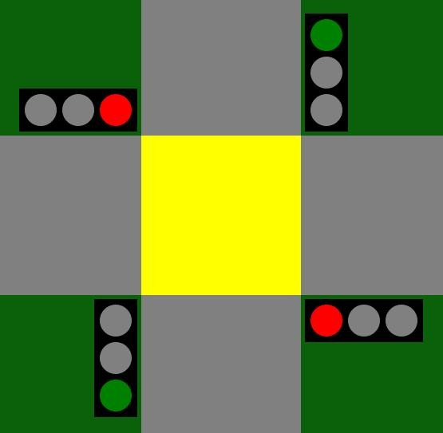
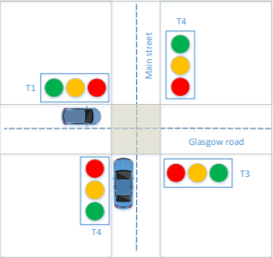
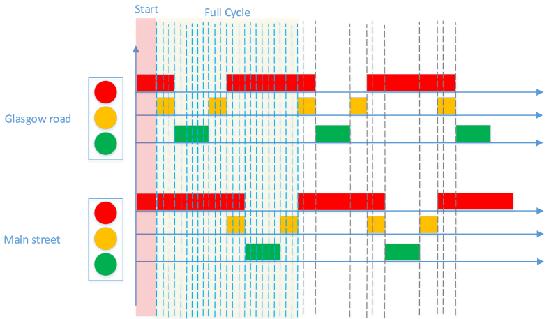
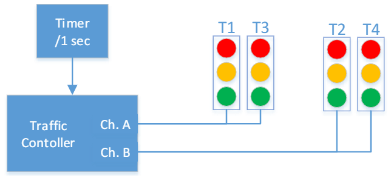
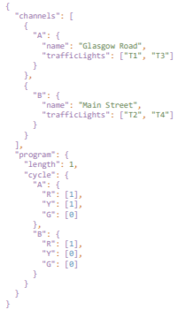
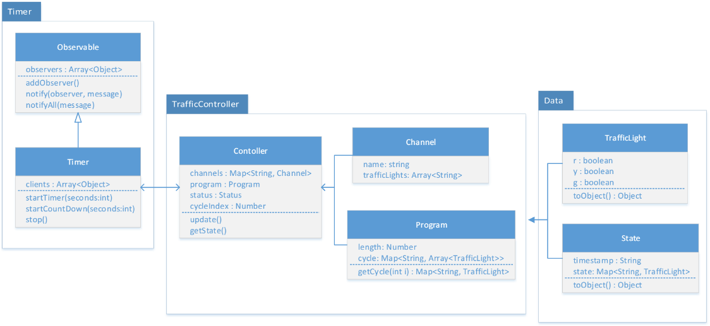

# Traffic-Light-System

Traffic Lights System is a simmulation of real-life traffic lights in an intersection.



# How to Install and run the Project

1. Clone this project with ```git clone```
2. You'll also need yarn so make sure you do ```yarn install```.
3. Finally, for running the project you'll need to do ```yarn dev```.

# The Idea

The idea was simple - create a road intersection. This was the idea of how it's supposed to look like:



As you can see, it's pretty much the same as the final product.

# Traffic Light Logic



The logic is straight-forward, one strip tells you what colour the traffic light should be.

For example, strip 5 tells us that the Glasgow Road (T1 & T3) traffic lights are green and Main Street (T2 & T4) traffic lights are red.



Each of the strips is worth a second, meaning that we update our traffic lights every second.

This is an example of a JSON file which respresents configuration for controller. Here's how it looks like:



# Back End

This UML diagram shows the Object Oriented Model. The backend has 2 timers, 1 timer starts with a 5 second delay, the other one continues by changing the traffic lights after.

The config file is made out of 2 parts: 
- First part shows traffic lights grouped by channels, 
- The second part is the program that presents how channel works.

Backend has an endpoint that provides data with state of controller and channels (at the time the data was requested).



# Front End

Frontend was made using react. It has it's own timer that fetches state data every second and uses that data to render traffic lights.